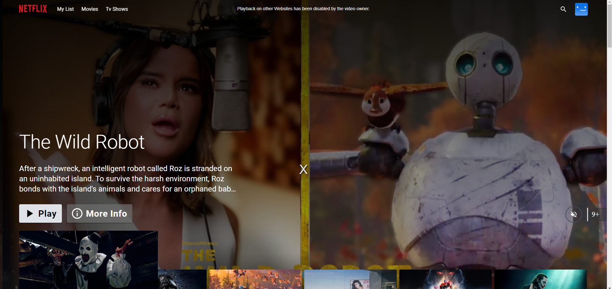
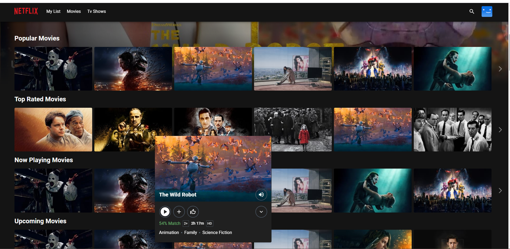

# Netflix Clone CI/CD Pipeline

This repository provides a comprehensive CI/CD pipeline setup for a Netflix clone project. It demonstrates the process of deploying, securing, and monitoring a web application using industry-standard tools. The pipeline includes steps for local deployment, security scanning, continuous integration and delivery, and monitoring, all managed with a range of DevOps tools.

## Project Overview

This project is a CI/CD setup for an existing Netflix clone application. Below, you'll find two screenshots of the interface:

## Requirements

To follow along and successfully replicate this setup, you will need:

- **AWS access**
- **GitHub account**
- **Gmail account**
- **Basic knowledge of AWS, Docker, and Kubernetes**

## Tools & Technologies Used

The pipeline and deployment setup use the following tools:

- **Jenkins**: CI/CD pipeline automation
- **SonarQube**: Code quality and security analysis
- **Trivy**: Container vulnerability scanning
- **Prometheus & Grafana**: Monitoring and visualization
- **ArgoCD**: GitOps for Kubernetes application deployment
- **Helm**: Kubernetes package management for streamlined deployment

## Project Setup and Implementation

1. **Single Server Setup**: The project begins by cloning the Netflix clone codebase onto a single server. The application is then deployed locally in a Docker container for initial testing.

2. **Security Enhancements**: Security checks are added using:
   - **SonarQube** for code quality and static analysis
   - **Trivy** for container security scanning

3. **CI/CD Pipeline with Jenkins**: Jenkins is integrated to automate the CI/CD pipeline. The pipeline includes build, test, and deployment stages for smooth continuous integration and delivery.

4. **Monitoring with Prometheus & Grafana**: Prometheus and Grafana are configured to monitor the application's health and performance metrics.

5. **Kubernetes Deployment with ArgoCD**: The application is then deployed on Kubernetes using ArgoCD for GitOps-based management.

6. **Monitoring and Deployment through Helm**: Helm charts are utilized for consistent deployment configurations and to facilitate easier application monitoring setup.

## Getting Started

For detailed steps to set up and replicate this project, refer to the included guide file, **`GUIDE.pdf`**, which provides a step-by-step breakdown of each component and command required to:

- Deploy the application locally
- Set up security tools
- Configure Jenkins for CI/CD
- Deploy to Kubernetes with ArgoCD
- Set up monitoring with Prometheus, Grafana, and Helm

## Contributing

Contributions are welcome! Please feel free to submit issues or pull requests for any improvements or additional functionality.

---
